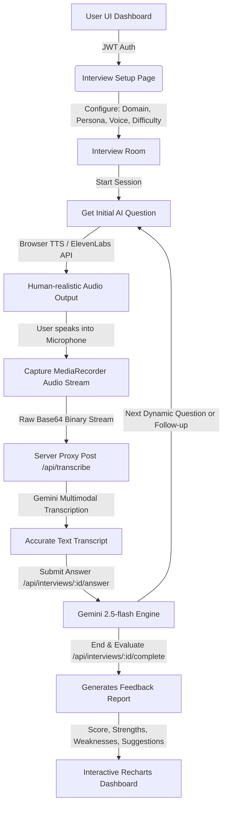

<p align="center">
  
</p>

<h1 align="center">🎤 Mockit – AI Mock Interview Platform</h1>

<p align="center">
  A modern AI-powered Full Stack Mock Interview Platform that simulates real-world technical and non-technical interviews using conversational AI, speech recognition, adaptive questioning, and human-like voice synthesis.
</p>

<p align="center">
  <a href="https://img.shields.io/badge/React-19-61DAFB?style=for-the-badge&logo=react&logoColor=white"></a>
  <a href="https://img.shields.io/badge/Node.js-22-339933?style=for-the-badge&logo=node.js&logoColor=white"></a>
  <a href="https://img.shields.io/badge/Express.js-Backend-000000?style=for-the-badge&logo=express&logoColor=white"></a>
  <a href="https://img.shields.io/badge/MongoDB-Database-47A248?style=for-the-badge&logo=mongodb&logoColor=white"></a>
  <a href="https://img.shields.io/badge/Google-Gemini-4285F4?style=for-the-badge&logo=google&logoColor=white"></a>
  <a href="https://img.shields.io/badge/ElevenLabs-Voice_AI-7B61FF?style=for-the-badge"></a>
  <a href="https://img.shields.io/badge/JWT-Authentication-000000?style=for-the-badge&logo=jsonwebtokens&logoColor=white"></a>
  <a href="https://img.shields.io/badge/Render-Deployed-46E3B7?style=for-the-badge&logo=render&logoColor=black"></a>
  <a href="https://img.shields.io/badge/License-MIT-yellow?style=for-the-badge"></a>
  <a href="https://img.shields.io/badge/Status-Active-success?style=for-the-badge"></a>
</p>

<p align="center">
  <a href="https://mockit-ai-mock-interview-platform.onrender.com/" target="_blank">
    
  </a>
  &nbsp;&nbsp;&nbsp;&nbsp;
  <a href="https://github.com/DeeptanshuSharma1011/Mockit-AI-Mock-Interview-Platform" target="_blank">
    
  </a>
</p>

---

## 📌 Table of Contents

- [🎤 Mockit – AI Mock Interview Platform](#-mockit--ai-mock-interview-platform)
  - [📌 Table of Contents](#-table-of-contents)
  - [📖 Project Overview](#-project-overview)
  - [🚀 Key Features](#-key-features)
  - [🛠️ Tech Stack](#️-tech-stack)
  - [📐 System Architecture](#-system-architecture)
  - [📂 Project Structure](#-project-structure)
  - [💻 Installation](#-installation)
  - [🔑 Environment Variables](#-environment-variables)
  - [🎯 How to Use](#-how-to-use)
  - [📡 API Endpoints](#-api-endpoints)
  - [⚙️ Available Scripts](#️-available-scripts)
  - [📸 Screenshots](#-screenshots)
  - [🔒 Security](#-security)
  - [🛣️ Future Roadmap](#️-future-roadmap)
  - [🤝 Contributing](#-contributing)
  - [📄 License](#-license)
  - [✍️ Author](#️-author)
  - [🙏 Acknowledgements](#-acknowledgements)
  - [📦 Repository Information](#-repository-information)

---

## 📖 Project Overview

Preparing for modern technical and behavioral interviews is often a lonely, expensive, and stressful experience. Candidates lack access to realistic, real-time interactive interview scenarios, and hiring human mentors for repetitive practice sessions is costly. 

**Mockit** is designed to close this gap. It is a highly customizable, conversational AI-driven mock interview simulator that behaves like an active human interviewer. Users undergo real-time speech-to-text enabled interviews where the AI agent dynamically generates adaptive technical and behavioral questions, reacts to responses with contextual feedback, and evaluates performance.

### The Problem Mockit Solves
- **High cost of mock interviews:** Makes professional-grade interview coaching accessible to anyone, anywhere.
- **Stage fright and performance anxiety:** Immersive simulation lets candidates build muscle memory through speech-driven interactive practice.
- **Vague or absent feedback:** Provides detailed analytical report cards highlighting specific strengths, weaknesses, and concrete recommendations.

---

## 🚀 Key Features

- **🔐 User & Session Security:** Integrated JWT authentication with robust cookie-based route guards and encrypted password hashing.
- **💼 Comprehensive Interview Domains:** Supports varied industry-standard roles including Software Engineering, System Design, Product Management, Behavioral/HR, Finance, Marketing, and Data Science.
- **📊 Granular Difficulty Control:** Choose between Intern/Junior, Mid-Level, and Lead/Senior thresholds which dynamically change the evaluation depth and complexity.
- **👥 Custom Interviewer Personalities:** Select from four distinct personas:
  - *The Technical Deep-Diver* (Rigorous, focus-driven male interviewer)
  - *The Supportive Mentor* (Encouraging, high-guidance female interviewer)
  - *The Executive Panelist* (Broad, high-level business focus male interviewer)
  - *The Direct & Critical Reviewer* (No-nonsense, high-scrutiny female interviewer)
- **🎙️ Production-Grade Audio Pipeline:** Captures mic streams directly using browser `MediaRecorder` APIs and converts audio to Base64 data for secure processing.
- **⚡ Server-Side Speech-to-Text (STT):** Transcribes verbal responses in real-time using Gemini's secure Multimodal engine, working perfectly inside nested preview frames.
- **🔊 Multi-Platform Text-to-Speech (TTS):** Uses premium human-realistic voices via ElevenLabs, with a resilient fallback to the native browser `SpeechSynthesis` Web Speech API.
- **🧠 Intelligent Adaptive Evaluation:** Deep analysis using `gemini-2.5-flash` to score answers, ask contextual follow-up questions, and track overall progress.
- **📈 Recharts Analytics Dashboard:** Visualizes history, performance trends over time, streaks, global mock rankings, and actionable targeted improvements.

---

## 🛠️ Tech Stack

| Layer | Technology | Badge / Details |
| :--- | :--- | :--- |
| **Frontend** | React 19, Vite 6, Tailwind CSS v4, Motion (Animations) | High-performance SPA with smooth visual state transitions |
| **Backend** | Node.js (v22), Express.js | Structured, type-safe API routing and proxy middleware |
| **Database** | Supabase (PostgreSQL) / MongoDB API | Complete persistence with automatic in-memory mockDB fallback |
| **Authentication** | JWT, BcryptJS | Secure token-based session verification & route control |
| **AI Engine** | Google GenAI SDK (`@google/genai`) | Content generation & intelligent assessment with `gemini-2.5-flash` |
| **Speech-to-Text** | Gemini Multimodal API | Secure base64 server-side transcribing, bypasses browser-frame limits |
| **Text-to-Speech** | ElevenLabs API / Web Speech API | Multi-channel realistic voice output with seamless fallback |
| **Deployment** | Render, Cloud Run Containers | Production-ready full-stack container environments |
| **Version Control** | Git / GitHub | Modular, semantic workflow tracking |

---

## 📐 System Architecture

Below is the execution flow demonstrating how a user configures their session, interacts verbally, and receives real-time speech and evaluation responses:



---

## 📂 Project Structure

Below is the directory structure showing a modular separation of concerns between client and server layers:

```hl
.
├── server.ts                  # Backend server launcher & entry point (Express)
├── package.json               # Dependencies, build scripts & engine config
├── .env.example               # Template documenting environmental configurations
├── tsconfig.json              # TypeScript compilation specifications
├── vite.config.ts             # React build pipeline plugin registrations
├── server/                    # Backend API Core
│   ├── config/                # Database and third-party credential initializers
│   │   └── db.ts              # Supabase/PostgreSQL connection & MockDB fallback logic
│   ├── middleware/            # Security routers
│   │   └── auth.ts            # JWT verification & payload decryption
│   ├── routes/                # Central API entry points
│   │   └── api.ts             # Route declarations mapped to express controllers
│   └── controllers/           # API handlers
│       ├── authController.ts  # Signups, Logins, and credential comparisons
│       ├── analyticsController.ts # Aggregates historical scoring logs
│       ├── interviewController.ts # Setup sessions, history retrieves, dashboard feeds
│       ├── aiInterviewController.ts # Gemini model conversations & audio transcribe pipeline
│       └── ttsController.ts   # ElevenLabs realistic audio synthesize proxy
└── src/                       # Frontend SPA (React 19, Tailwind v4)
    ├── App.tsx                # Coordinates page state, global context & routing
    ├── main.tsx               # Bootstrap client rendering
    ├── index.css              # Custom font bindings and tailwind variables
    ├── types.ts               # Global shared type specifications
    ├── lib/                   # Utility scripts
    └── components/            # UI components and page layouts
        ├── LandingPage.tsx    # Marketing, on-boarding features & animations
        ├── AuthPage.tsx       # Tabbed Login/Registration interface
        ├── DashboardPage.tsx  # Analytics charts, history list & recent reports
        ├── InterviewSetupPage.tsx # Domain, Difficulty, and Persona configurators
        └── ActiveInterviewPage.tsx # Immersive recording studio, real-time diagnostic logs
```

---

## 💻 Installation

Follow these steps to set up and run Mockit on your local development machine:

### 1. Clone the Repository
```bash
git clone https://github.com/DeeptanshuSharma1011/Mockit-AI-Mock-Interview-Platform.git
cd Mockit-AI-Mock-Interview-Platform
```

### 2. Install Dependencies
You can install both server and client packages with a single npm command:
```bash
npm install
```

### 3. Configure Environment Variables
Create a local `.env` file in the root folder based on the example configuration:
```bash
cp .env.example .env
```
Open `.env` and fill in your API credentials (see [Environment Variables](#-environment-variables) for descriptions).

### 4. Run the Development Server
This boots up the backend Express server running Vite as middleware on port `3000`:
```bash
npm run dev
```
Open your browser and navigate to `http://localhost:3000`.

### 5. Build for Production
Compiles the React assets and bundles the backend TypeScript server into a self-contained production-ready CJS file:
```bash
npm run build
```

### 6. Run Production Server
Launches the compiled server from `/dist`:
```bash
npm run start
```

---

## 🔑 Environment Variables

The application requires the following environment variables. The server includes automatic fallbacks (such as an in-memory MockDB for database and Web Speech API for TTS) if optional variables are absent.

| Variable Name | Required | Description | Fallback Behavior |
| :--- | :---: | :--- | :--- |
| `GEMINI_API_KEY` | **Yes** | AI Engine for questions, evaluations, and Speech-to-Text | Server will fail if not defined |
| `JWT_SECRET` | **Yes** | Security key used to sign and verify user JWTs | Defaults to static fallback |
| `SUPABASE_URL` | *No* | Supabase database API URL | Automatically activates local, in-memory MockDB |
| `SUPABASE_PUBLIC_KEY`| *No* | Supabase database Public / Anon API Key | Automatically activates local, in-memory MockDB |
| `SUPABASE_SERVICE_ROLE_KEY` | *No* | Highly recommended backend auth key to bypass RLS policies | Uses `SUPABASE_PUBLIC_KEY` |
| `ELEVENLABS_API_KEY` | *No* | High-fidelity human-like voice synthesis | System falls back to native Web Speech Synthesis |
| `APP_URL` | *No* | Base URL of deployment for redirects | Defaults to `http://localhost:3000` |

---

## 🎯 How to Use

Follow this streamlined user workflow to run a successful mock interview:

1. **Sign Up:** Register with your name, email, and password. Credentials are securely encrypted and verified.
2. **Login:** Log in to generate your secure JWT session.
3. **Choose Interview Category:** Select whether you want to practice **Technical** or **Non-Technical / Behavioral** interviews.
4. **Choose Domain & Role:** Pick from roles like *Software Engineering*, *Product Management*, *System Design*, or *Data Science*.
5. **Set Difficulty:** Match your level (*Junior*, *Intermediate*, *Senior*) to scale prompt expectations.
6. **Configure Voice & Persona:** Pick your interviewer (e.g., *The Supportive Mentor*) and choose between browser standard speech or *ElevenLabs realistic voices*.
7. **Conduct Interview:** 
   - Press the **Start** button to hear the interviewer speak the opening question.
   - Click the **Microphone** button to record your spoken response.
   - Click **Stop** to automatically upload and transcribe your speech.
   - Your transcript displays in the textbox. You can review or edit it manually, then press **Submit** to trigger the next dynamic follow-up.
8. **Analyze Performance:** End the session to view scores, detailed transcripts, and personalized suggestions plotted on the interactive dashboards!

---

## 📡 API Endpoints

All APIs are prefixed with `/api` and require a valid Bearer Token inside HTTP `Authorization` headers unless marked otherwise:

| Method | Endpoint | Description | Auth Required |
| :---: | :--- | :--- | :---: |
| **POST** | `/api/auth/signup` | Register a new user account | *No* |
| **POST** | `/api/auth/login` | Authenticate and retrieve a JWT access token | *No* |
| **GET** | `/api/auth/me` | Fetch detailed profile schema of the active user | **Yes** |
| **GET** | `/api/dashboard` | Fetch dashboard charts, scores, history, and suggestions | **Yes** |
| **POST** | `/api/interviews/setup` | Create a new structured interview session | **Yes** |
| **GET** | `/api/interviews/:id` | Fetch details and question-answer list of a specific interview | **Yes** |
| **POST** | `/api/interviews/:id/start` | Trigger AI generation of the opening question | **Yes** |
| **POST** | `/api/interviews/:id/answer` | Submit user transcript; triggers dynamic follow-up prompt | **Yes** |
| **POST** | `/api/interviews/:id/complete`| Conclude interview and invoke comprehensive AI assessment | **Yes** |
| **POST** | `/api/interviews/:id/abort` | Abort session early and request evaluations on completed parts | **Yes** |
| **POST** | `/api/transcribe` | Securely proxy base64 audio binaries to Gemini STT engine | **Yes** |
| **GET** | `/api/tts/status` | Inquire whether ElevenLabs credentials and pre-configured voices are operational | **Yes** |
| **POST** | `/api/tts` | Synthesize custom text to realistic speech audio stream | *No* |

---

## ⚙️ Available Scripts

These scripts are pre-configured in your `package.json` to manage development, compilation, and production environments:

- **`npm run dev`**
  Boots up the server in development mode using `tsx`. Auto-mounts Vite middleware to provide live compilation for both frontend and backend files.
- **`npm run build`**
  Builds the production-optimized React assets using Vite, and then uses `esbuild` to compile and bundle the backend `server.ts` into a unified, self-contained `dist/server.cjs` file.
- **`npm run start`**
  Launches the fully compiled Express server using native production Node processes. Runs on port `3000` to bind to container network ports.
- **`npm run clean`**
  Removes the generated `dist` directories and residual compiled artifacts.
- **`npm run lint`**
  Executes TypeScript compiler audits (`tsc --noEmit`) to verify overall codebase type safety.

---

## 📸 Screenshots

### 🔑 Authentication Gate
<p align="center">
  
</p>

### 📈 Interactive Analytics Dashboard
<p align="center">
  
</p>

### 💼 Interview Configuration Board
<p align="center">
  
</p>

### 🎙️ The Active Interview Room & Diagnostics
<p align="center">
  
</p>

---

## 🔒 Security

Mockit relies on strict web-security standards to guarantee session integrity and guard user privacy:

- **🔐 Robust Token-Based Authentication:** Standard JSON Web Tokens (JWT) are signed and verified at every server API route.
- **🛡️ Encrypted Password Secrets:** Password strings are parsed and hashed via multiple salt rounds using high-grade `bcryptjs`, preventing plain-text data exposures.
- **📦 Secure Server-Side Secrets Management:** Sensitive credentials (such as `GEMINI_API_KEY` and `ELEVENLABS_API_KEY`) are kept exclusively in backend environment variables. The client never gets direct exposure to proprietary API keys, protecting your integrations from leakage.
- **🎯 Bypassing WebSpeech Frame Security:** Native WebSpeech recognition is frequently blocked inside iframe environments (like Google AI Studio preview windows) due to network sandbox restrictions. Mockit implements **Server-Side STT Proxying**; raw voice bytes are uploaded as Base64 to a protected `/api/transcribe` endpoint, transcribing securely and flawlessly.

---

## 🛣️ Future Roadmap

- [ ] **📸 Video Mock Interviews:** Use webcam stream analytics to evaluate candidate eye contact, posture, and facial expression indices.
- [ ] **📄 AI Resume Analyzer:** Scan resume files to automatically curate custom-tailored interview queues targeting past experiences.
- [ ] **💻 Immersive Live Coding Panels:** Integrate code-editors with automatic compiling so candidates can solve DSA problems in real-time.
- [ ] **🏢 Company-Specific Presets:** Simulate historical hiring patterns for tier-1 companies like Google, Meta, Apple, and Netflix.
- [ ] **🎯 AI Career Mentor:** Generate detailed learning plans and study resources based on weaknesses identified during mock evaluations.
- [ ] **🌎 Multilingual Interview Options:** Conduct full voice assessments in languages like Spanish, Hindi, German, Mandarin, and French.

---

## 🤝 Contributing

Contributions are welcome! If you want to refine Mockit, please follow these steps:

1. Fork the project repository.
2. Create your Feature Branch: `git checkout -b feature/AmazingFeature`.
3. Commit your changes: `git commit -m "Add some AmazingFeature"`.
4. Push to the branch: `git push origin feature/AmazingFeature`.
5. Open a **Pull Request**.

Ensure that you run `npm run lint` and verify your changes build successfully before submitting code!

---

## 📄 License

This project is licensed under the MIT License - see the [LICENSE](LICENSE) file for details.

---

## ✍️ Author

**Deeptanshu Sharma**  
📧 Email: [deepusteam1011@gmail.com](mailto:deepusteam1011@gmail.com)  
💻 GitHub: [@DeeptanshuSharma1011](https://github.com/DeeptanshuSharma1011)

---

## 🙏 Acknowledgements

We want to highlight the phenomenal open-source technologies and AI engines that power Mockit:

- **React & Vite:** For providing a lightning-fast UI loop and responsive frontend rendering.
- **Google Gemini:** For serving as the cognitive engine for question generation, evaluation, and multimodal speech transcribing.
- **ElevenLabs Voice AI:** For providing realistic voice assets that make conversational mock simulations possible.
- **Recharts:** For offering interactive visualization tools.
- **Tailwind CSS:** For the visual layouts.

---

## 📦 Repository Information

### GitHub Repository Description
Mockit is an AI-powered Full Stack Mock Interview Platform that simulates technical/behavioral interviews. Features realistic interviewer personas, dynamic adaptive questioning, server-side speech-to-text with Gemini Multimodal API, human-like voice synthesis via ElevenLabs, and granular evaluation dashboards.

### GitHub Topics
`react`, `nodejs`, `expressjs`, `mongodb`, `supabase`, `gemini-api`, `google-gemini`, `speech-to-text`, `text-to-speech`, `elevenlabs`, `speech-recognition`, `ai-interviews`, `interview-prep`, `multimodal-ai`, `recharts`, `motion-react`, `full-stack`, `typescript`, `adaptive-learning`, `jwt-auth`

### Resume-Ready Highlights
1. **Designed & Built a Full-Stack AI Interview Simulator:** Integrated `React 19` and `Express` to create a conversational mock-interview workspace supporting 7 domains and 4 distinct AI personas.
2. **Created a Resilient Speech-to-Text Architecture:** Bypassed iframe sandboxing and browser SpeechRecognition API limitations by deploying a custom base64-based server-side audio transcription pipeline powered by `Gemini's Multimodal API`.
3. **Implemented Realistic Voice Synthesis:** Integrated `ElevenLabs Voice AI` to synthesize conversational interview flows with realistic human cadence, adding dynamic browser-based fallback speech APIs to ensure 100% system availability.
4. **Engineered Rich Analytics Dashboards:** Designed interactive visual dashboards using `Recharts` to display strengths, weaknesses, average scores, and personalized suggestions based on structured, AI-evaluated responses.
5. **Architected Resilient Hybrid Persistence:** Devised a flexible database connector layer supporting `Supabase PostgreSQL` for live cloud persistence, coupled with a seamless zero-configuration local in-memory mockDB fallback for instant deployments.
